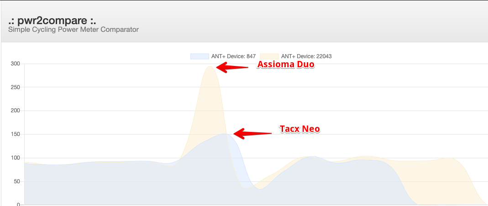

# pwr2compare
Basic cycling power meter comparator
---
Simple NodeJS based tool to compare the measures from two ANT+ cycling power meters.



**Requirements:**

NodeJS >= v9.0

Ant+ USB Dongle

Tested on RaspberryPi 3B+ but might work on any Linux based machine (MacOs & Windows untested).

**Installation:**

```
git clone https://github.com/ea1nk/pwr2compare.git
```
```
npm install
```

**Usage:**

Both ANT+ device IDs are required and an optional averaging time in seconds might be provided.

If no averaging factor is provided, it will be set to 3 seconds.
```
node server.js ID1 ID2 averaging_time
```

Open a browser at http://localhost:8090 and enjoy!

Recorded data can be exported to a spreadsheet for further analysis.
